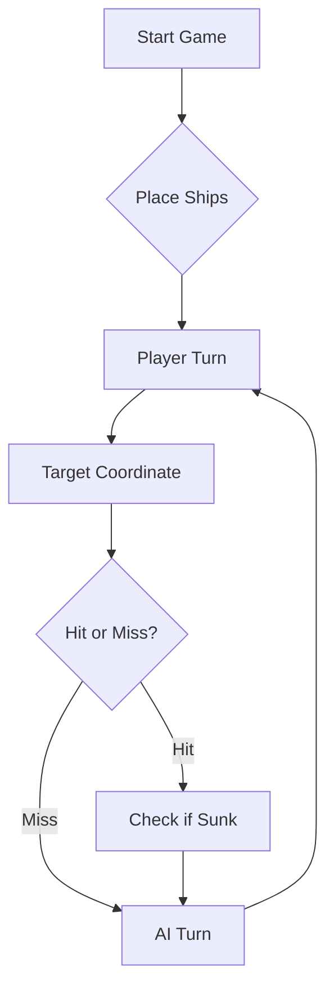

# ⚓ Battleship 2.0


> A modern take on the classic naval warfare game, designed for the XVII century setting with updated software engineering patterns.

---

## 📖 Table of Contents

- [Project Overview](#-project-overview)
- [Key Features](#-key-features)
- [Technical Stack](#-technical-stack)
- [Installation & Setup](#-installation--setup)
- [Code Architecture](#-code-architecture)
- [Roadmap](#-roadmap)
- [Contributing](#-contributing)
- [Sprint - Part 2: LLM Training](#-sprint---part-2-llm-training)
---

## 🎯 Project Overview
This project serves as a template and reference for students learning **Object-Oriented Programming (OOP)** and **Software Quality**. It simulates a battleship environment where players must strategically place ships and sink the enemy fleet.

### 🎮 The Rules
The game is played on a grid (typically 10x10). The coordinate system is defined as:

$$(x, y) \in \{0, \dots, 9\} \times \{0, \dots, 9\}$$

Hits are calculated based on the intersection of the shot vector and the ship's bounding box.

---

## ✨ Key Features
| Feature | Description | Status |
| :--- | :--- | :---: |
| **Grid System** | Flexible $N \times N$ board generation. | ✅ |
| **Ship Varieties** | Galleons, Frigates, and Brigantines (XVII Century theme). | ✅ |
| **AI Opponent** | Heuristic-based targeting system. | 🚧 |
| **Network Play** | Socket-based multiplayer. | ❌ |

---

## 🛠 Technical Stack
* **Language:** Java 17
* **Build Tool:** Maven / Gradle
* **Testing:** JUnit 5
* **Logging:** Log4j2

---

## 🚀 Installation & Setup

### Prerequisites
* JDK 17 or higher
* Git

### Step-by-Step
1. **Clone the repository:**
   ```bash
   git clone [https://github.com/britoeabreu/Battleship2.git](https://github.com/britoeabreu/Battleship2.git)
   ```
2. **Navigate to directory:**
   ```bash
   cd Battleship2
   ```
3. **Compile and Run:**
   ```bash
   javac Main.java && java Main
   ```

---

## 📚 Documentation

You can access the generated Javadoc here:

👉 [Battleship2 API Documentation](https://britoeabreu.github.io/Battleship2/)


### Core Logic
```java
public class Ship {
    private String name;
    private int size;
    private boolean isSunk;

    // TODO: Implement damage logic
    public void hit() {
        // Implementation here
    }
}
```

### Design Patterns Used:
- **Strategy Pattern:** For different AI difficulty levels.
- **Observer Pattern:** To update the UI when a ship is hit.
</details>

### Logic Flow


---

## 🗺 Roadmap
- [x] Basic grid implementation
- [x] Ship placement validation
- [ ] Add sound effects (SFX)
- [ ] Implement "Fog of War" mechanic
- [ ] **Multiplayer Integration** (High Priority)

---

## 🧪 Testing
We use high-coverage unit testing to ensure game stability. Run tests using:
```bash
mvn test
```

> [!TIP]
> Use the `-Dtest=ClassName` flag to run specific test suites during development.

---

## 🤝 Contributing
Contributions are what make the open-source community such an amazing place to learn, inspire, and create.

1. Fork the Project
2. Create your Feature Branch (`git checkout -b feature/AmazingFeature`)
3. Commit your Changes (`git commit -m 'Add some AmazingFeature'`)
4. Push to the Branch (`git push origin feature/AmazingFeature`)
5. Open a **Pull Request**

---

## 🤖 Sprint - Part 2: LLM Training

### Communication Protocol

The interaction with the LLM was performed using JSON objects, both for sending moves and receiving results.

Each move consists of 3 shots in the following format:

```
{
  "shots": [
    {"row": "A", "column": 5},
    {"row": "C", "column": 10},
    {"row": "F", "column": 5}
  ]
}
```

The system responds with a JSON object containing information about the results of the move, including valid shots, repeated shots, shots outside the board, hits, and sunk ships.

---

### LLM Strategy

A Large Language Model (LLM) was used to simulate a Battleship player.

The implemented strategy includes:

- Maintaining a battle log with all previous moves
- Avoiding repeated coordinates
- Respecting board limits (A–J, 1–10)
- Using a distributed search strategy when no hits are found
- Targeting adjacent positions after a hit
- Determining ship orientation after multiple hits
- After sinking a ship, excluding surrounding positions

The model was trained using the **few-shot prompting** technique, through iterative interactions between the game and the LLM.

---

### Example Interaction

LLM move:
```
{
  "shots": [
    {"row": "E", "column": 5},
    {"row": "F", "column": 6},
    {"row": "D", "column": 4}
  ]
}
```
Game response:
```
rajada E5 F6 D4
Jogada nº2 -> 3 tiros válidos: 1 tiro num(a) Nau + 2 tiros na água
JSON enviado para o LLM:
{
  "validShots" : 3,
  "sunkBoats" : [ ],
  "repeatedShots" : 0,
  "outsideShots" : 0,
  "hitsOnBoats" : [ {
    "hits" : 1,
    "type" : "Nau"
  } ],
  "missedShots" : 2
}

Tempo da jogada: 16 ms
Estado da Frota: 11 a flutuar, 0 afundados!
```
---

## 📄 License
Distributed under the MIT License. See `LICENSE` for more information.

# Video de demostração do projeto
https://youtu.be/jI6xYpNlyHE
---
**Maintained by:** [@britoeabreu](https://github.com/britoeabreu)  
*Created for the Software Engineering students at ISCTE-IUL.*

# Resposta Ficha 3 Tarefa 2 Parte A Ponto 4
# Margarida Ribeiro 124133 - Long Method 
Para a deteção de cheiros ao código, foi escolhido o cheiro “Long Method”, definido por Martin Fowler como métodos excessivamente longos e complexos, difíceis de compreender, testar e manter.

Com base neste conceito, foi utilizado um modelo de linguagem (LLM) para gerar um workflow YAML que integra o Qodana for JVM com o GitHub Actions, permitindo automatizar a análise do código.

O workflow criado executa o Qodana sempre que ocorre um push na branch principal, utilizando o perfil recomendado de inspeções do IntelliJ IDEA. Esta ferramenta analisa o código com base em métricas ao nível do método, nomeadamente a complexidade ciclomática (Cyclomatic Complexity), o número de linhas de código (Lines of Code) e o número de parâmetros (Number of Parameters).

Estas métricas são utilizadas como indicadores quantitativos para identificar métodos potencialmente problemáticos, seguindo as orientações do livro “Object-Oriented Metrics in Practice”. Métodos com valores elevados nestas métricas são considerados candidatos ao cheiro “Long Method”.

Desta forma, o workflow permite automatizar a deteção deste tipo de problema no código, integrando práticas de qualidade de software no processo de desenvolvimento.
